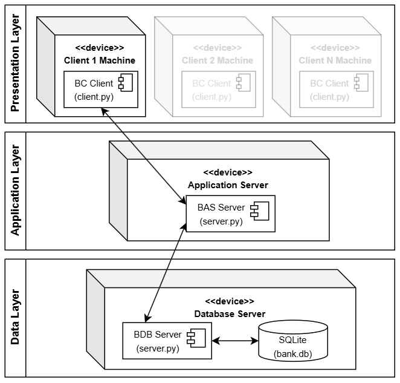
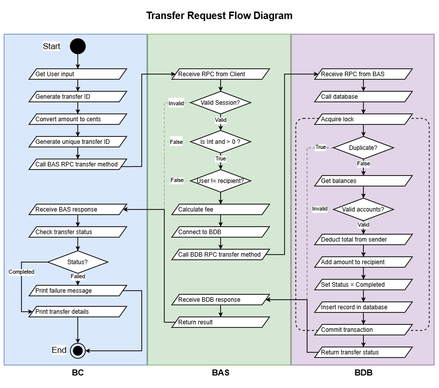

# Distributed Banking System
A three-tier distributed banking system built for a Distributed Systems assignment, implemented in Python using Pyro5 (RPC) and SQLite. A customer can log in, check their balance, and send money to another account.

The design below is adapted from my submitted assignment report

---

## Architecture
```
 BC Client  <---- RPC (Pyro5) ---->  BAS Server  <---- RPC (Pyro5) ---->  BDB Server
(customer)                      (business logic)                    (SQLite storage)
```



- **BC Client**: the customer-facing app. Handles sign-in, balance queries, and transfer requests/status checks. Has no direct access to the database.
- **BAS Server**: the application layer. Handles authentication, session/token management, input validation, fee calculation, transfer orchestration, and logging.
- **BDB Server**: the data layer. The only component that talks to SQLite. Stores users, accounts, balances, transfer records, and audit logs.
All communication uses **Pyro5** for request/response calls, since most operations in this system (login, balance query, transfer submission, status lookup) are synchronous, the client needs an immediate answer before it can proceed.
 


---

## Design and Rationale

### Communication: Pyro5 vs gRPC
 
Each tier communicates using Pyro5 RPC, both BC to BAS, and BAS to BDB. For a simple mock application, Pyro5 was chosen because it is easy to set up. For a complex enterprise application, gRPC's strengths would be worth the additional setup.
 
### Processing: Synchronous vs Asynchronous
 
All operations in the system are synchronous i.e., the caller waits for a response. For logging in, it is synchronous because the client cannot do anything until it knows if authentication succeeded and would just be waiting there. Balance, and Status checks are synchronous because the user is waiting there for the result, and there are no side effects to worry about.
 
Transfers are synchronous so the user receives a 'Completed' or 'Failed' response immediately. In production, a real bank might be async to improve throughput and resilience, which would then require use of the 'Pending' response.
 
### Authentication
 
Authentication is handled entirely by BAS. The client sends a username and password, BAS verifies them against the stored hash and if successful, returns a session token. The client can then use that session token with each request and BAS validates it before performing any action. The session token will expire after 10 minutes.
 
### Authorisation
 
Authorisation uses the session token and the user associated with it is associated with. This is so a malicious actor cannot send other usernames to gain unauthorised access. This ensures that a user can only access their own account.
 
### Validation
 
Inputs are checked in the client so the user can be reprompted on bad inputs. The inputs are validated again by BAS for safety. BAS rejects negative amounts, and if someone transfers to themselves, and BDB aborts a transaction if insufficient funds, or invalid recipient. Errors will return a message.
 
### Money Representation
 
All money is stored in cents and never floating points at any time. This is to avoid rounding errors. Percentage fees are calculated using the Decimal module from the standard library and converted back to cents.
 
### Persistence and Audit
 
Every transfer is stored within the database with an ID, sender, recipient, amount, fee, status, reference, and a timestamp so there is a complete history.
 
### Transport Security
 
In a production system, communication between BC : BAS, and BAS : BDB would be secured using TLS so that passwords and tokens cannot be intercepted. The database should also probably be on a private network.
 
### Fee Policy
 
All fees are calculated using the fee table. Calculated in order of raw fee, rounded up, then apply the cap.
 
### Consistency
 
Because a single transfer would modify multiple database records, the database performs the operation as one atomic transaction. The balance check happens within the transaction to prevent two transactions passing at the same time and overdrawing an account.
 
### Failure Handling
 
The system handles three types of failure. Partial updates are prevented by performing the debit, credit, and transfer record in one atomic transaction, so if any step fails then none of the changes are committed. Duplicate requests are prevented by using a transfer ID. If the database receives the same transfer ID, it will return the transaction record instead of performing it again. Retries are safe for the same reason, a client that resubmits the same transfer id will receive the transaction record of that ID. This makes it idempotent.
 
---

## Setup
 
1. **Install dependencies**
```bash
   pip install Pyro5
```
 
2. **Start the BDB Server** (data layer)
```bash
   python -m bdb_server.db_server
```
 
3. **Start the BAS Server** (application layer)
```bash
   python -m bas_server.server
```
 
4. **Run the BC Client** (presentation layer)
```bash   
   python -m bc_client.client
```

---

### Test Accounts

   | User ID | Username | Password    | Balance (cents) | Balance (USD) |
|---------|----------|-------------|------------------|---------------|
| 1       | user1    | password1   | 500000           | $5,000.00     |
| 2       | user2    | password2   | 1000             | $10.00        |
| 3       | user3    | password3   | 99900000         | $999,000.00   |
| 4       | user4    | password4   | 4000000          | $40,000.00    |
| 5       | user5    | password5   | 15000000         | $150,000.00   |
| 6       | user6    | password6   | 0                | $0.00         |